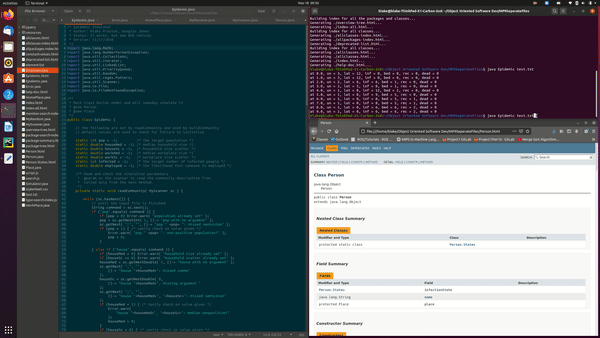

# EpidemicSimulator

## Overview

Project is ongoing and features are added every week. Includes Javadoc comments for easier visualization and documentation.

## Usage

After compiling:

```
java Epidemic test.txt //This runs the simulation of the given input in test.txt

javadoc Person.java //Example use of javadoc that outputs html page of documentation

```

## Input File

Input files at this moment only support the given inputs. However you can change the values of each input.

```
pop 15;
house 3.2, 1;        // median and scatter of houshold sizes
infected 12;
employed 0.5;        // probability of employment
workplace 10.5, 12;  // median and scatter of workplace size (syntax error?)
end 10.0;

```

